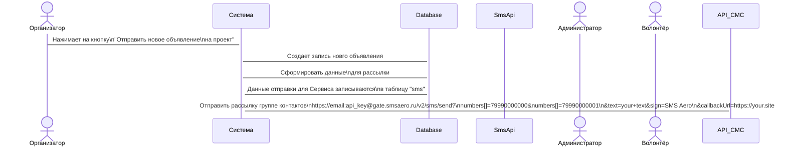

# docs-as-code
Хранение документации

# Заголовок - Sequence Diagram 

* код
* рисунок диаграммы
  

### Отправка SMS-сообщений sms/send

| Параметр	        | Формат	|    Применение	|   Описание            |
|-------------------|---------|---------------| ----------------------|
|number	            | string  | 	Обязательно |	Номер телефона.       |
|numbers	          | array	  | Обязательно   |	Номера телефонов.     |
|sign	string	      |         | Обязательно   |	Имя отправителя.      |
|text	string        |         |	Обязательно   |	Текст сообщения.      |
