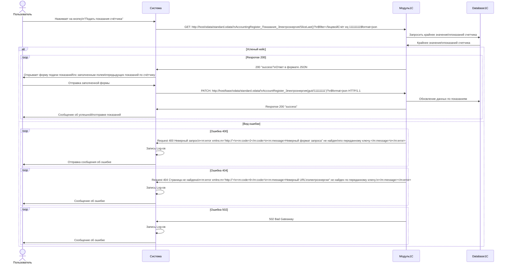

# Заголовок - Sequence Diagram 

# Отправка показаний счётчика

* код
* рисунок диаграммы
  

```mermaid

sequenceDiagram
actor Пользователь
participant Система
participant Модуль1С
participant Database1С

Пользователь->>Система : Нажимает на кнопку\n"Подать показания счётчика"
Система->>Модуль1С : GET: http://host/odata/standard.odata/\nAccountingRegister_Показания_Электроэнергия/SliceLast()?\n$filter=ЛицевойСчёт eq 11111111$format=json
Модуль1С->>Database1С : Запросить крайнее значение\nпоказаний счетчика
Database1С->>Модуль1С : Крайнее значение\nпоказаний счетчика

    alt Успеный кейс
    loop Response 200
Модуль1С->>Система : 200 "success"\nОтвет в формате JSON
Система->>Пользователь : Открывает форму подачи показаний\nс заполненным полем\nпредыдущих показаний по счётчику
Пользователь ->>Система : Отправка заполненной формы
Система ->>Модуль1С : PATCH: http://host/base/odata/standard.odata/\nAccountRegister_Электроэнергия(guid'11111111')?\n$format=json HTTP/1.1
Модуль1С ->>Database1С : Обновление данных по показаниям
Модуль1С ->>Система : Response 200 "success"
Система ->>Пользователь : Сообщение об успешной/nотправке показаний
end
else Вид ошибки
    loop Ошибка 400
    Модуль1С->>Система : Request 400 Неверный запрос\n<m:error xmlns:m="http://">\n<m:code>2</m:code>\n<m:message>Неверный формат запроса" не найден\nпо переданному ключу.</m:message>\n</m:error>
    Система ->>Система : Запись Log-ов
    Система ->>Пользователь : Отправка сообщения об ошибке
    end
    loop Ошибка 404
    Модуль1С ->>Система : Request 404 Страница не найдена\n<m:error xmlns:m="http://">\n<m:code>6</m:code>\n<m:message>Неверный URL\nэлектроэнергии" не найден по переданному ключу.\n</m:message></m:error>
    Система ->>Система : Запись Log-ов
    Система->>Пользователь : Сообщение об ошибке
    end
    loop Ошибка 502
     Модуль1С ->>Система : 502 Bad Gateaway
    Система ->>Система : Запись Log-ов
    Система ->>Пользователь : Сообщение об ошибке
end
end
```
