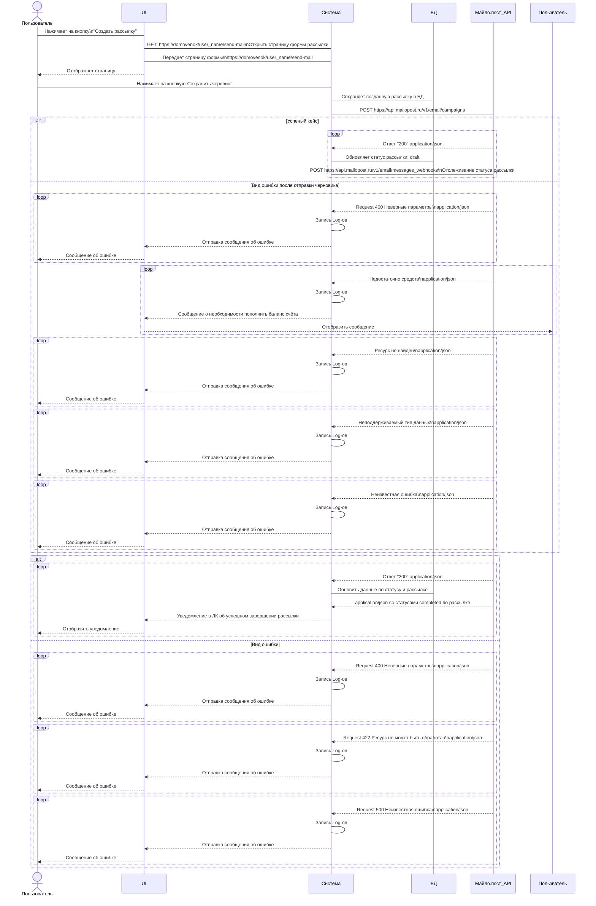

# Заголовок - Sequence Diagram 

# Рассылка e-mail писем

* код
* рисунок диаграммы
  

```mermaid

sequenceDiagram
actor Пользователь
participant UI
participant Система
participant БД
participant Майло.пост_API

Пользователь -> UI : Нажимает на кнопку\n"Создать рассылку"
UI -> Система : GET: https://domovenok/user_name/send-mail\nОткрыть страницу формы рассылки
Система -> UI : Передает страницу формы\nhttps://domovenok/user_name/send-mail
UI -->> Пользователь : Отображает страницу
Пользователь -> Система : Нажимает на кнопку\n"Сохранить черовик"
Система -> БД : Сохраняет созданную рассылку в БД
Система -> Майло.пост_API : POST https://api.mailopost.ru/v1/email/campaigns

alt Успеный кейс 
loop#00ffa1 Ответ 200
Майло.пост_API-->>Система  : Ответ "200" application/json
Система ->  БД : Обновляет статус рассылки: draft
Система -> Майло.пост_API :POST https://api.mailopost.ru/v1/email/messages_webhooks\nОтслеживание статуса рассылки
end
else Вид ошибки после отправки черновика
    loop#ff005e Ошибка 400
    Майло.пост_API -->>Система : Request 400 Неверные параметры\napplication/json
    Система -> Система : Запись Log-ов
    Система -->> UI : Отправка сообщения об ошибке
    UI -->> Пользователь : Сообщение об ошибке
    end
    loop#ff005e Ошибка 402
    Майло.пост_API-->>Система : Недостаточно средств\napplication/json;
    Система -> Система : Запись Log-ов
    Система -->> UI: Сообщение о необходимости пополнить баланс счёта
    UI -->> Пользватель : Отобразить сообщение
    end
    loop#ff005e Ошибка 404
    Майло.пост_API-->>Система : Ресурс не найден\napplication/json
    Система -> Система : Запись Log-ов
    Система -->> UI : Отправка сообщения об ошибке
    UI -->> Пользователь : Сообщение об ошибке
    end
    loop#ff005e Ошибка 415
    Майло.пост_API-->>Система : Неподдерживаемый тип данных\napplication/json
    Система -> Система : Запись Log-ов
    Система -->> UI : Отправка сообщения об ошибке
    UI -->> Пользователь : Сообщение об ошибке
    end
    loop#ff005e Ошибка 500
    Майло.пост_API-->>Система : Неизвестная ошибка\napplication/json
    Система -> Система : Запись Log-ов
    Система -->> UI : Отправка сообщения об ошибке
    UI -->> Пользователь : Сообщение об ошибке
    end
end
     alt#00ffa1 Ответ 200
    loop
        Майло.пост_API-->>Система  : Ответ "200" application/json
        Система -> БД : Обновить данные по статусу и рассылке
        Майло.пост_API-->>Система : application/json со статусами completed по рассылке
        Система -->> UI : Уведомление в ЛК об успешном завершении рассылки
        UI -->> Пользователь : Отобразить уведомление
      end
        else Вид ошибки
        loop#ff005e Ошибка 400
        Майло.пост_API-->>Система : Request 400 Неверные параметры\napplication/json
        Система -> Система : Запись Log-ов
        Система -->> UI : Отправка сообщения об ошибке
        UI -->> Пользователь : Сообщение об ошибке
        end
        loop#ff005e Ошибка 422
        Майло.пост_API-->>Система : Request 422 Ресурс не может быть обработан\napplication/json
        Система -> Система : Запись Log-ов
        Система -->> UI : Отправка сообщения об ошибке
        UI -->> Пользователь : Сообщение об ошибке
        end
        loop#ff005e Ошибка 500
        Майло.пост_API-->>Система : Request 500 Неизвестная ошибка\napplication/json
        Система -> Система : Запись Log-ов
        Система -->> UI : Отправка сообщения об ошибке
        UI -->> Пользователь : Сообщение об ошибке
        end
end

```
