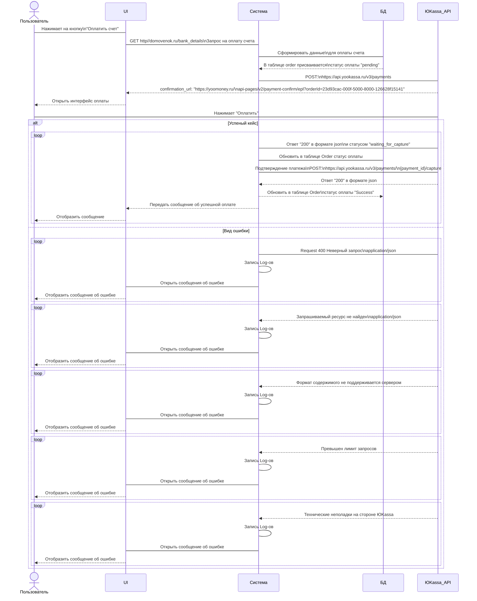

# Sequence-диаграмма

# ЮKassa

* код
* рисунок диаграммы
  

```mermaid
sequenceDiagram

actor Пользователь
participant UI
participant Система
participant БД
participant ЮKassa_API

Пользователь -> UI : Нажимает на кнопку\n"Оплатить счет"
UI -> Система: GET http//domovenok.ru/bank_details\nЗапрос на оплату счета
Система -> БД : Сформировать данные\nдля оплаты счета
БД -->>Система : В таблице order присваивается\nстатус оплаты "pending" 
Система -> ЮKassa_API : POST:\nhttps://api.yookassa.ru/v3/payments
ЮKassa_API -->> UI : confirmation_url: "https://yoomoney.ru/\napi-pages/v2/payment-confirm/epl?orderId=23d93cac-000f-5000-8000-126628f15141"
UI-->>Пользователь : Открыть интерфейс оплаты
Пользователь -> ЮKassa_API : Нажимает "Оплатить"

alt Успеный кейс
    loop#00ffa1 Ответ 200
ЮKassa_API -> Система  : Ответ "200" в формате json\nи статусом "waiting_for_capture"
Система ->  БД : Обновить в таблице Order статус оплаты
Система -> ЮKassa_API : Подтверждение платежа\nPOST:\nhttps://api.yookassa.ru/v3/payments/\n{payment_id}/capture
ЮKassa_API -->>Система : Ответ "200" в формате json
Система -->> БД: Обновить в таблице Order\nстатус оплаты "Success"
Система -->> UI : Передать сообщение об успешной оплате
UI -->> Пользователь: Отобразить сообщение
  end
  else Вид ошибки
    loop#ff005e Ошибка 400
    ЮKassa_API  -> Система : Request 400 Неверный запрос\napplication/json
    Система -> Система : Запись Log-ов
    Система -> UI : Открыть сообщения об ошибке
    UI -->> Пользователь: Отобразить сообщение об ошибке
    end
    loop#ff005e Ошибка 404
    ЮKassa_API -->>Система : Запрашиваемый ресурс не найден\napplication/json;
    Система -> Система : Запись Log-ов
    Система -> UI : Открыть сообщение об ошибке
    UI -->> Пользователь: Отобразить сообщение об ошибке
    end
    loop#ff005e Ошибка 415
    ЮKassa_API-->>Система : Формат содержимого не поддерживается сервером
    Система -> Система : Запись Log-ов
    Система -> UI : Открыть сообщение об ошибке
    UI -->> Пользователь: Отобразить сообщение об ошибке
    end
    loop#ff005e Ошибка 429
    ЮKassa_API-->>Система : Превышен лимит запросов
    Система -> Система : Запись Log-ов
    Система -> UI : Открыть сообщение об ошибке
    UI -->> Пользователь: Отобразить сообщение об ошибке
    end
    loop#ff005e Ошибка 500
    ЮKassa_API-->>Система : Технические неполадки на стороне ЮKassa
    Система -> Система : Запись Log-ов
    Система -> UI : Открыть сообщение об ошибке
    UI -->> Пользователь: Отобразить сообщение об ошибке
    end
end

```
