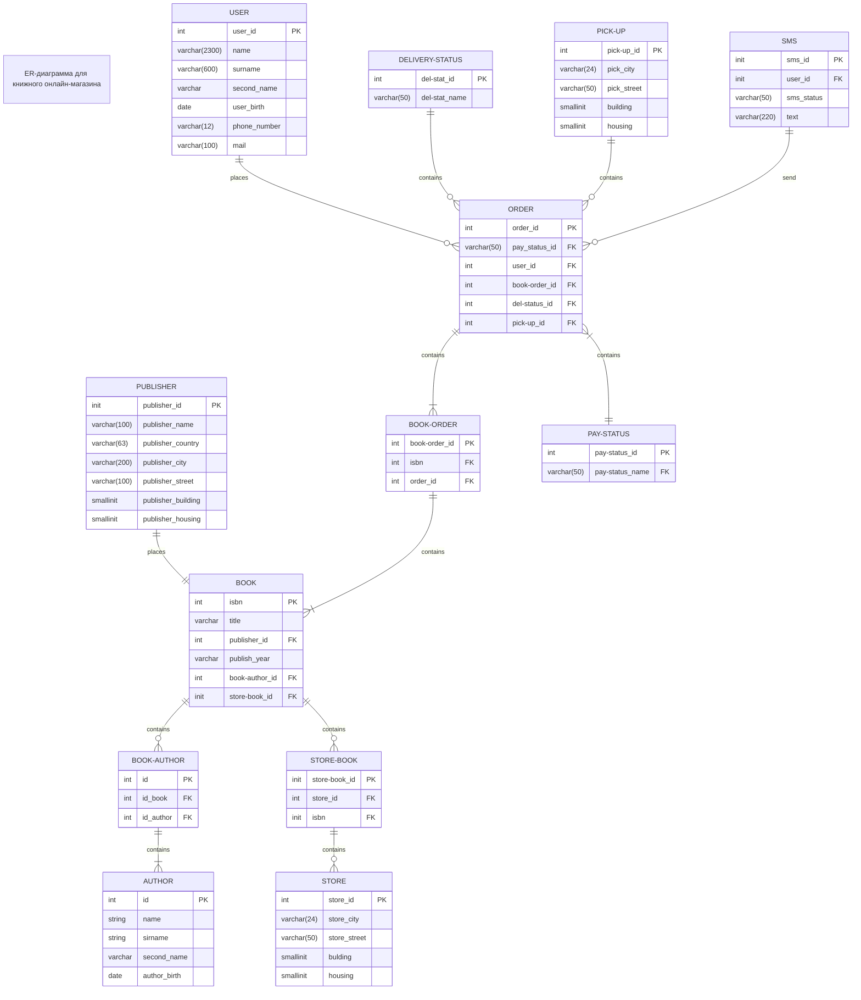

## ERD

```mermaid

erDiagram
"ER-диаграмма для книжного онлайн-магазина"

    BOOK ||--o{ BOOK-AUTHOR : contains
    BOOK ||--o{ STORE-BOOK : contains
    BOOK {
        int isbn PK
        varchar title
        int publisher_id FK
        varchar publish_year
        int book-author_id FK
        init store-book_id FK
    }
    BOOK-AUTHOR ||--|{ AUTHOR : contains
    BOOK-AUTHOR {
        int id PK
        int id_book FK
        int id_author FK
    }

    AUTHOR {
        int id PK
        string name
        string sirname
        varchar second_name
        date author_birth
    }

    PUBLISHER ||--|| BOOK : places
    PUBLISHER {
        init publisher_id PK
        varchar(100) publisher_name
        varchar(63) publisher_country
        varchar(200) publisher_city
        varchar(100) publisher_street
        smallinit publisher_building
        smallinit publisher_housing
    }

    BOOK-ORDER ||--|{ BOOK : contains
    BOOK-ORDER {
        int book-order_id PK
        int isbn FK
        int order_id FK
    }

    ORDER }|--|| PAY-STATUS : contains
    ORDER ||--|{ BOOK-ORDER  : contains 
    ORDER {
        int order_id PK
        varchar(50) pay_status_id FK
        int user_id FK
        int book-order_id FK
        int del-status_id FK
        int pick-up_id FK
    }

    PAY-STATUS {
        int pay-status_id PK
        varchar(50) pay-status_name FK
    }

    USER ||--o{ ORDER : places
    USER {
        int user_id PK
        varchar(2300) name
        varchar(600) surname
        varchar second_name
        date user_birth
        varchar(12) phone_number
        varchar(100) mail
    }

    DELIVERY-STATUS ||--o{ ORDER : contains
    DELIVERY-STATUS {
    int del-stat_id PK
    varchar(50) del-stat_name 
    }

    PICK-UP ||--o{ ORDER : contains
    PICK-UP {
    int pick-up_id PK
    varchar(24) pick_city
    varchar(50) pick_street
    smallinit building
    smallinit housing
    }

    STORE {
    int store_id PK
    varchar(24) store_city
    varchar(50) store_street
    smallinit bulding
    smallinit housing
    }

    STORE-BOOK ||--o{ STORE: contains
    STORE-BOOK {
    init store-book_id PK
    int store_id FK
    init isbn FK
    }

    SMS ||--O{ ORDER : send
    SMS {
    init sms_id PK
    init user_id FK
    varchar(50) sms_status
    varchar(220) text
    }

```
