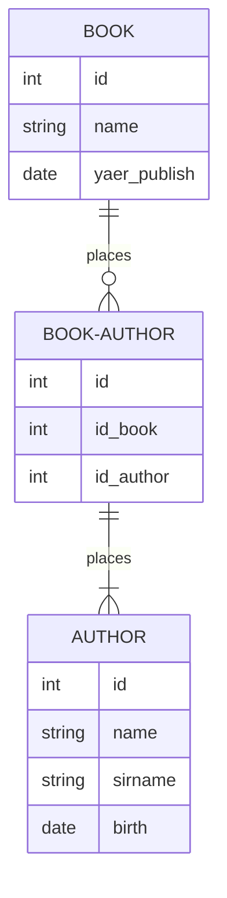

## ERD

```mermaid

erDiagram
    BOOK ||--o{  BOOK-AUTHOR : places
    BOOK {
        int id
        string name
        date yaer_publish
    }
    BOOK-AUTHOR ||--|{ AUTHOR : places
    BOOK-AUTHOR {
        int id
        int id_book
        int id_author
    }

    AUTHOR {
        int id
        string name
        string sirname
        date birth
    }


```
